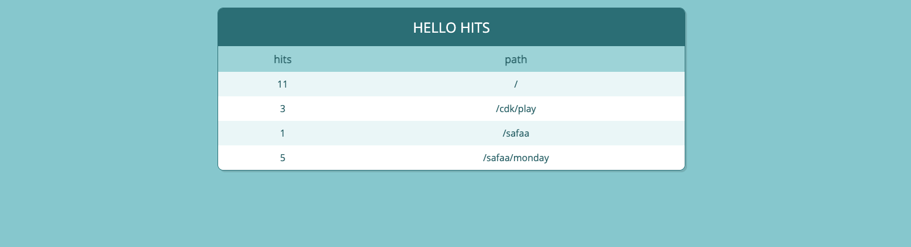

# Welcome to your CDK TypeScript project!

You should explore the contents of this project. It demonstrates a CDK app with an instance of a stack (`CdkWorkshopStack`)
which contains an Amazon SQS queue that is subscribed to an Amazon SNS topic.

The `cdk.json` file tells the CDK Toolkit how to execute your app.

## Useful commands

 * `npm run build`   compile typescript to js
 * `npm run watch`   watch for changes and compile
 * `npm run test`    perform the jest unit tests
 * `cdk deploy`      deploy this stack to your default AWS account/region
 * `cdk diff`        compare deployed stack with current state
 * `cdk synth`       emits the synthesized CloudFormation template


## installed libraries

```bash
npm install @aws-cdk/aws-lambda
npm install @aws-cdk/aws-apigateway
npm install @aws-cdk/aws-dynamodb
npm install cdk-dynamo-table-viewer
```

# AWS CDK Workshop

https://cdkworkshop.com/

The final example contains three lambdas, two endpoints (API GW) and one dynamodb.
- Hello: a lambda which is connected to an endpoint which can be triggered directly and it invokes another lambda.
- HitCounter: a lambda which is called internally by Hello lambda and stores an entry in dynamodb table. It counts the hits to speific path from Hello endpoint.
- TableView: a lmabda created with constructor library which reads from dynamodb table and has an endpoint which renders a UI of number of hits ( values of ddb table). Check the screenshot below.
  


## Test
```bash
 npm run build & npx jest
````